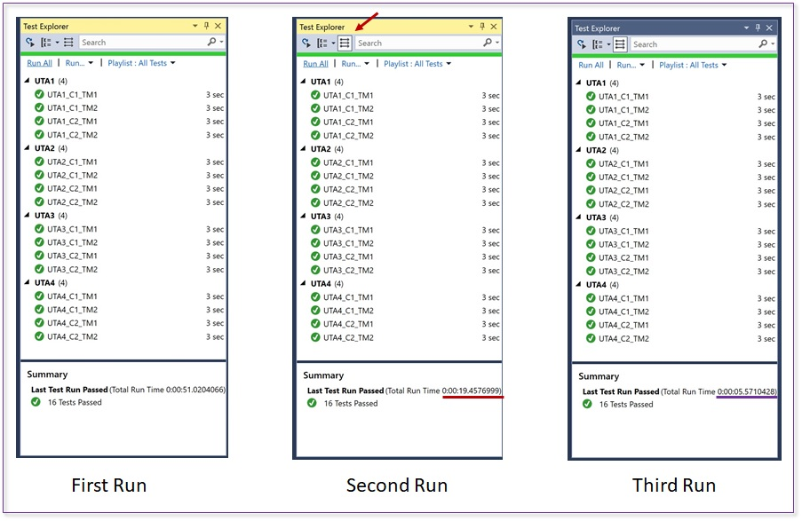

# Sample
The following is a sample for the in-assembly parallel test execution feature in MSTest V2. Please note that the feature is still in an alpha stage.
To know more about the feature, please see [RFC 004-In-Assembly-Parallel-Execution.md](https://github.com/Microsoft/testfx-docs/blob/master/RFCs/004-In-Assembly-Parallel-Execution.md).
The sample illustrates the following:
1. Over 3 runs it shows how test execution performance can be progressively improved. That last run is where we enable in-assembly parallel execution.
2. The test lifecycle method semantics (as described in the RFC above)

## Code
There are 4 test assemblies: UTA1, UTA2, UTA3, UTA4
Each assembly contains 2 test classes: C!, C2
Each test class contains 2 test methods: TM1, TM2
Each test takes 3 secs to run.

## Progressively making test execution faster
The following image shows the results from the 3 runs. The test explorer contents have been grouped by project.

### First run
All test run in sequence. This total run time is about 51 secs (16 test x 3secs per test) + overhead

### Second run
We enable process-parallel test execution. You can read more about that in this [blog post]([https://blogs.msdn.microsoft.com/devops/2016/10/10/parallel-test-execution/).
Test execution is launched on each available core as a distinct process, and handed an assembly worth of tests to execute.
The total run time in this case is about 19 secs. On a 4 core machine, the run ought to take about the 1/4th the time. On my laptop, i see these times. YMMV a little.
Nonetheless the second rin is faster.

### Third run
**Now we switch on in-assembly parallel** as well.
In this example, that is done by configuring the test run with a .runsettings file.
Now we have process-parallel AND in-assmebmly parallel.
The total run time in this case is around 5.5 secs.

## Test lifecycle method semantics
The test lifecycle methods have been setup to throw an exception if their semantics as called out in the RFC are not met. Since the tests all pass, it implies that the semantics are honoured.
